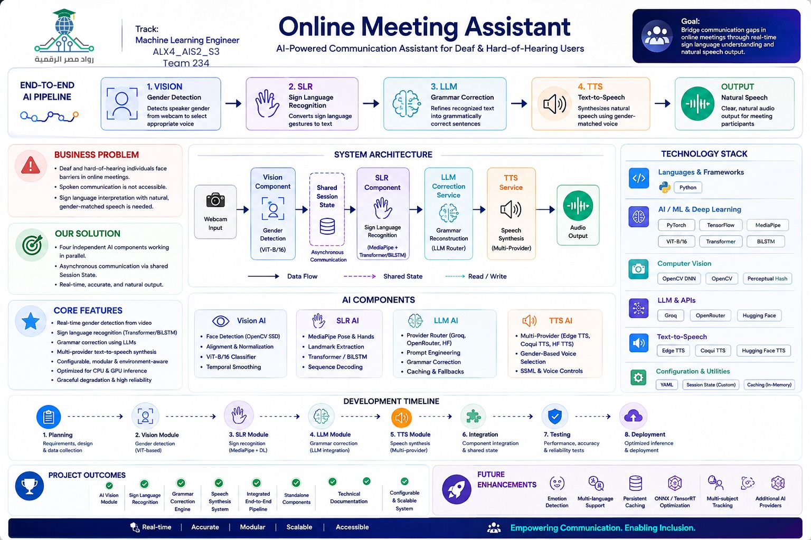

# Silentia

**End-to-end assistive communication pipeline for the deaf and hard-of-hearing community.**

Silentia fuses **computer vision, sign language recognition, large language models, and speech synthesis** into a single orchestrated pipeline that converts sign-language gestures captured from a video or webcam into natural, grammatically-correct, gender-matched spoken audio — in real time.

> *Empowering communication. Enabling inclusion.*

`real-time · accurate · modular · scalable · accessible`

---

## Table of Contents

- [Overview](#overview)
- [Infographic](#infographic)
- [How it works](#how-it-works)
- [Pipeline architecture](#pipeline-architecture)
- [Components](#components)
- [Getting started](#getting-started)
- [Configuration reference](#configuration-reference)
- [Output format](#output-format)
- [Testing](#testing)
- [Project structure](#project-structure)
- [Troubleshooting](#troubleshooting)
- [Roadmap](#roadmap)
- [Acknowledgments](#acknowledgments)

---

## Infographic

A single-page visual overview of the platform, its modules, and its future roadmap:



---

## How it works

Silentia addresses a fundamental communication barrier: the gap between sign-language users and people who do not understand sign. The system:

1. **Watches** a person signing (pre-recorded video or live webcam).
2. **Recognizes** the gestures and transcribes them into raw sign-language text (e.g. `mother like cook food`).
3. **Repairs** the inherently telegraphic structure of sign language using an LLM, producing natural spoken English (e.g. `"My mother likes to cook food."`).
4. **Voices** the result with a gender-matched synthesized voice — male or female, selected from the Vision component's prediction.

The project is organized as **four independent components** coordinated by a lightweight **orchestrator**. Every component runs as an isolated subprocess with its own virtual environment, so each can be developed, versioned, and replaced independently — this also means the orchestrator never modifies any component code.

---

## Pipeline architecture

The orchestrator executes the pipeline in three phases:

| Phase | Stage | Mode | Description |
|-------|-------|------|-------------|
| **1** | Vision | Parallel | Frame-gated face detection + gender classification (`male` / `female` / `no_face`) |
| **1** | SLR | Parallel | Sign-language recognition over the video → raw sign text sequence |
| **2** | LLM | Sequential | Grammar/vocabulary repair of the telegraphic sign text → natural spoken sentence |
| **3** | TTS | Sequential | Speech synthesis using a voice matched to the detected gender |

```
                    ┌─────────────────────────┐
                    │       Orchestrator      │
                    │  config.yaml + CLI      │
                    └──────┬──────────┬───────┘
                           │          │
            ┌──────────────▼───┐  ┌───▼──────────────┐
            │  Vision (GPU)    │  │  SLR (CPU)       │
            │  gender label    │  │  sign → text     │
            └────────┬─────────┘  └───┬──────────────┘
                     │                │
                     │   ┌────────────▼────────┐
                     │   │  LLM                │
                     │   │  text repair        │
                     │   └────────────┬────────┘
                     │                │
            ┌────────▼────────────────▼─┐
            │  TTS                      │
            │  gender-matched speech    │
            └───────────────────────────┘
```

- **File mode** — process a pre-recorded video.
- **Webcam mode** — capture a fixed-duration clip live from a webcam, then run the pipeline.

Each stage reports `completed` / `skipped` / `failed` status, per-stage latency in milliseconds, and structured results, all aggregated into a final `PipelineResult`.

---

## Components

### 🎥 Vision Component — Gender Detection

Real-time **gender classification** from video using a ViT-B/16 classifier head fine-tuned on UTKFace.

- Face detection with configurable confidence thresholds and multi-face strategies (`largest`, …)
- Frame gating to skip non-informative frames and save compute
- Face alignment and temporal smoothing for stable, flicker-free predictions
- GPU/CUDA and CPU device support, with per-environment configs (`development` / `production`)

**Stack:** PyTorch · OpenCV (SSD face detector) · ViT-B/16 · Albumentations

### 🤟 SLR Component — Sign Language Recognition

Classifies a **100-sign ASL vocabulary** (`book`, `drink`, `go`, `mother`, `help`, `computer`, …) into text sequences, using the WLASL-100 dataset.

- Two model architectures: LSTM and **BiLSTM** sequence classifiers
- `single` (isolated sign) and `continuous` (sequence) inference modes
- Checkpoint-based inference with configurable label maps, top-k outputs, and confidence scores
- CPU-first design for accessibility on commodity hardware
- Training notebooks and evaluation artifacts included (`results/`: classification reports, confusion matrices, training curves)

**Stack:** PyTorch · OpenCV · (Bi)LSTM sequence models · WLASL-100

### 🧠 LLM Component — Sign-Text Repair Engine

Repairs the missing articles, prepositions, and inflection that are inherent to sign language, producing natural, TTS-ready spoken English.

- **Multi-provider routing with automatic failover:** Groq → OpenRouter → OpenRouter-free → HuggingFace
- Deterministic prompt system with domain instructions (medical, legal, casual) and glossary substitution
- Input guards (max tokens, alpha ratio, passthrough for short inputs) and output validation (length ratio, markdown/quote stripping)
- Response caching (TTL-based) and retry policies per provider
- `standalone` and `system` modes; `development` and `production` environments

**Stack:** Python · Groq / OpenRouter / HuggingFace APIs · Pydantic schemas

### 🔊 TTS Component — Text-to-Speech

Converts the repaired text into audio using a **gender-matched voice**.

- Provider priority with fallback: **Edge TTS → Coqui TTS (VITS)**
- Voice selection based on the gender predicted by the Vision component (`male` / `female` / neutral)
- Adjustable speech rate (`0.5`–`2.0`) and output modes: `file` (save WAV) or `play` (play live)
- Voice listing CLI for discovery and benchmarking CLI for provider comparison

**Stack:** Edge-TTS · Coqui TTS (VITS) · sounddevice/soundfile

### 🎛️ Orchestrator — The Control Plane

The control plane that wires the four components together.

- Subprocess isolation — each component uses its own venv; **zero component code changes**
- Parallel Phase 1 (Vision + SLR) via thread pool, sequential Phases 2–3
- Per-stage configurable timeouts, structured `PipelineResult` schemas
- Session-based temp artifacts (`tmp/`) with optional auto-cleanup (`--cleanup`)
- Supports both video files and live webcam capture (`--webcam`)

---

## Getting started

### Prerequisites

- Python 3.9+ (3.11 recommended)
- One virtual environment per component (see below)
- API keys for LLM providers (Groq / OpenRouter / HuggingFace) — copy `LLM component/.env.example` to `.env` and fill in
- Model weights are **not committed** to the repo; download them via the Vision component's `scripts/download_weights.py` (or place your trained checkpoints in the paths the components expect)

### 1. Clone & install

```bash
git clone https://github.com/AbdelrahmanAtef5172/silentia-online-meeting-assistant.git
cd silentia

# Create each component's virtual environment
python -m venv "Vision component/venv"
"Vision component/venv/bin/pip" install -r "Vision component/requirements.txt"

python -m venv "SLR component/.venv"
"SLR component/.venv/bin/pip"   install -r "SLR component/requirements.txt"

python -m venv "LLM component/.venv"
"LLM component/.venv/bin/pip"   install -r "LLM component/requirements.txt"

python -m venv "TTS component/.venv"
"TTS component/.venv/bin/pip"   install -r "TTS component/requirements.txt"

# Orchestrator deps (opencv-python, pyyaml)
python -m venv orchestrator/.venv
orchestrator/.venv/bin/pip install -r orchestrator/requirements.txt
```

### 2. Configure

Edit `orchestrator/config.yaml` to point each component at its local root, venv, checkpoint, and model paths. See the [Configuration reference](#configuration-reference) section for every option.

### 3. Run the pipeline

```bash
# Process a pre-recorded video
python orchestrator/orchestrate.py --video path/to/sign.mp4

# Capture 10 seconds from webcam 0 and process it
python orchestrator/orchestrate.py --webcam --duration 10

# Continuous-sign mode, speech rate 1.2x, play audio instead of saving
python orchestrator/orchestrate.py --video path/to/sign.mp4 \
  --slr-mode continuous --tts-mode play --tts-speed 1.2

# Disable temporary file cleanup to keep session artifacts
python orchestrator/orchestrate.py --video path/to/sign.mp4 --cleanup
```

#### CLI reference

| Flag | Default | Description |
|------|---------|-------------|
| `--video PATH` | — | Input video file (mutually exclusive with `--webcam`) |
| `--webcam [ID]` | — | Capture from webcam then process |
| `--slr-mode` | `single` | `single` or `continuous` SLR mode |
| `--duration` | `10.0` | Webcam capture duration (seconds) |
| `--tts-mode` | `file` | `file` (save WAV) or `play` (play audio) |
| `--tts-speed` | `1.0` | Speech rate, `0.5`–`2.0` |
| `--config` | `config.yaml` | Orchestrator config path |
| `--cleanup` | off | Delete session temp files after the run |

---

## Configuration reference

All paths are resolved relative to the config file's directory.

| Key | Default | Description |
|-----|---------|-------------|
| `pipeline.slr_mode` | `single` | Default SLR mode (`single` / `continuous`) |
| `pipeline.webcam_duration_sec` | `10.0` | Default webcam capture duration |
| `components.vision.root` | `../Vision component` | Vision component root |
| `components.vision.venv` | `../Vision component/venv` | Vision venv python |
| `components.vision.script` | `scripts/process_video.py` | Vision entry script |
| `components.vision.config_path` | … | Vision component config |
| `components.vision.env` | `development` | Vision environment (`development` / `production`) |
| `components.slr.root` | `../SLR component` | SLR component root |
| `components.slr.venv` | `../SLR component/.venv` | SLR venv python |
| `components.slr.checkpoint` | … | SLR model checkpoint (*.pt) |
| `components.slr.label_map` | … | Label map JSON (class index → word) |
| `components.slr.models_dir` | … | Directory of auxiliary models |
| `components.slr.device` | `cpu` | Inference device |
| `components.llm.root` | `../LLM component` | LLM component root |
| `components.llm.venv` | `../LLM component/.venv` | LLM venv python |
| `components.llm.script` | `scripts/run_standalone.py` | LLM entry script |
| `components.llm.env` | `development` | LLM environment |
| `components.tts.root` | `../TTS component` | TTS component root |
| `components.tts.venv` | `../TTS component/.venv` | TTS venv python |
| `components.tts.script` | `cli/run_standalone.py` | TTS entry script |
| `components.tts.env` | `development` | TTS environment |
| `timeouts_seconds.vision` | `600` | Vision stage timeout (seconds) |
| `timeouts_seconds.slr` | `600` | SLR stage timeout (seconds) |
| `timeouts_seconds.llm` | `120` | LLM stage timeout (seconds) |
| `timeouts_seconds.tts` | `120` | TTS stage timeout (seconds) |

---

## Output format

The orchestrator prints a structured JSON result on completion:

```json
{
  "success": true,
  "vision": {
    "status": "completed",
    "result": {
      "label": "female",
      "confidence": 0.98,
      "total_frames": 210,
      "fps": 29.97
    }
  },
  "slr": {
    "status": "completed",
    "result": {
      "text": "mother like cook food",
      "confidence": 0.87,
      "top_k": [ ... ],
      "words": [ ... ]
    }
  },
  "llm": {
    "status": "completed",
    "result": {
      "original_text": "mother like cook food",
      "corrected_text": "My mother likes to cook food."
    }
  },
  "tts": {
    "status": "completed",
    "result": {
      "audio_path": ".../silentia_<session>.wav",
      "text_spoken": "My mother likes to cook food.",
      "gender_used": "female",
      "provider": "edge"
    }
  },
  "error": null
}
```

Output audio is written to `TTS output/` (e.g. `silentia_<session-id>.wav`). Session temp files live in `orchestrator/tmp/`.

---

## Testing

Each component ships its own `tests/` suite (pytest):

```bash
"Vision component/venv/bin/pytest"  "Vision component/tests"
"SLR component/.venv/bin/pytest"    "SLR component/tests"
"LLM component/.venv/bin/pytest"    "LLM component/tests"
"TTS component/.venv/bin/pytest"    "TTS component/tests"
```

Coverage highlights:
- **Vision:** frame-gate behavior, full pipeline end-to-end on fixtures
- **SLR:** inference, model loading, top-k outputs
- **LLM:** input guards, cache hit/miss, provider routing, prompt construction, response processing
- **TTS:** provider fallback, voice selection by gender, audio output, service layer

Per-component notebooks and demo scripts are included for reproducing the reported results.

---

## Project structure

```
├── orchestrator/               # Pipeline control plane
│   ├── orchestrate.py          #  3-phase orchestrator (subprocess-based)
│   ├── schemas.py              #  PipelineInput / StageResult / PipelineResult
│   ├── config.yaml             #  component paths, venvs, models, timeouts
│   ├── live.py                 #  live (webcam) entrypoints
│   └── adapters/               #  per-component CLI adapters
├── "Vision component"/         # Gender detection (ViT-B/16 + OpenCV)
│   ├── engine/                 #   detector, classifier, frame gate, smoother
│   ├── scripts/                #   process_video, demo_webcam, download_weights
│   ├── configs/                #   dev/prod configs
│   ├── docs/                   #   block diagram, finetuning notebook
│   └── tests/
├── "SLR component"/            # Sign language recognition (BiLSTM, 100 signs)
│   ├── src/                    #   inference, models (LSTM + BiLSTM)
│   ├── config/                 #   configs + 100-word label map
│   ├── notebooks/             #   training notebooks (WLASL-100)
│   ├── demos/                 #   single & continuous-sign test videos
│   ├── results/               #   classification reports, matrices, curves
│   └── tests/
├── "LLM component"/             # Sign-text grammar repair (multi-provider)
│   ├── engine/               #   router, cache, guards, prompt builder
│   ├── model_providers/     #   groq, openrouter, huggingface
│   ├── examples/            #   standalone + pipeline usage
│   ├── scripts/             #   run_standalone, benchmark
│   └── tests/
└── "TTS component"/             # Gender-matched speech synthesis (Edge/Coqui)
    ├── cli/                   #   run_standalone, list_voices, benchmark
    ├── engines/              #   edge_provider, coqui_provider
    ├── lib/                  #   service, voice_selector, audio output
    └── tests/
```

> **Note:** directories contain spaces (e.g. `Vision component/`). Quote paths in shell commands, as shown above.

Each component is self-contained: its own source, tests, demos, configs, block diagrams, and documentation PDFs.

---

## Troubleshooting

| Problem | Likely cause / fix |
|---------|--------------------|
| `SLR output file not created` / SLR fails | Check `components.slr.checkpoint` points to an existing `.pt` and the label map matches the trained vocabulary |
| LLM returns failure | Missing API keys — copy `.env.example` to `.env` and fill in `GROQ_API_KEY` / `OPENROUTER_API_KEY` / `HF_API_KEY` (see `LLM component`) |
| TTS says "no text to synthesize" | The LLM stage was skipped because SLR produced empty text — check the video contains clear signs |
| `No module named ...` from a component | Component's venv is missing a dep — re-run its `pip install -r requirements.txt` |
| Vision/` no face detected` | Increase face-detection confidence, or ensure the subject's face is visible |
| Pipeline prints `success: false` | Inspect the per-stage `error` field in the JSON result |

---

## Roadmap

- [ ] Continuous-sign sentence-level decoding with beam search
- [ ] Expanded vocabulary beyond 100 signs
- [ ] Real-time (streaming) inference across the full pipeline
- [ ] Lip-sync / avatar output (visual feedback for sign-language users)
- [ ] Dockerized end-to-end deployment
- [ ] Multi-language sign support (beyond ASL)

---

## Acknowledgments

Built with PyTorch, OpenCV, HuggingFace, Groq, OpenRouter, Edge-TTS, and Coqui TTS — and the support of the people who believe communication should include everyone.

---

*Silentia — Real-time · Accurate · Modular · Scalable · Accessible · "Empowering Communication. Enabling Inclusion."*